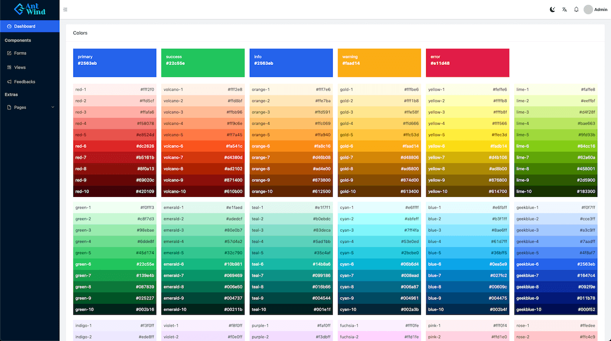
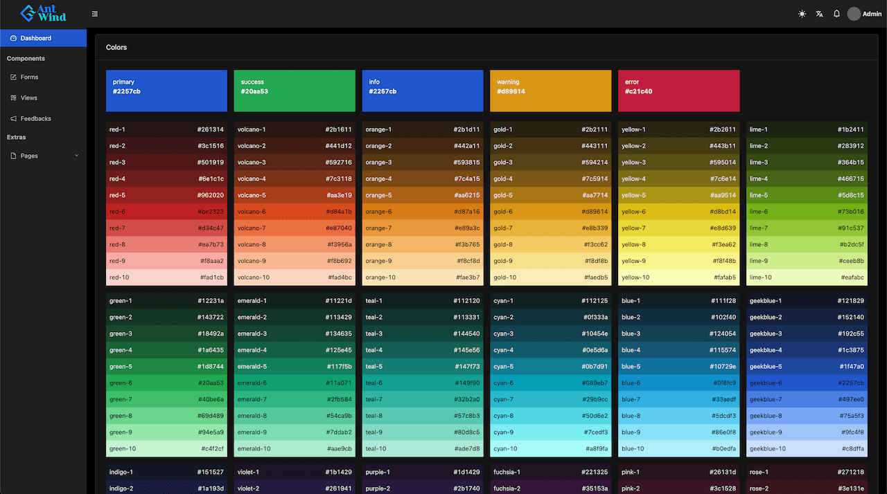

<p align="center">
  
</p>

<h1 align="center"> React Antd Tailwind Starter </h1>

<p align="center"> An opinionated boilerplate create-react-app with Ant Design and Tailwindcss</p>

<p>
  
  
  <div style="clear: both;"></div>
</p>


```bash
git clone https://github.com/rnwathon/react-antd-tailwind-starter.git project-name
cd project-name
yarn install
yarn start
```

> Recommended to use yarn instead of npm because of the peer-dependencies problem with currect craco version and newest react-scripts.

## What's in the stack

| dependencies | version |
| ------------ | ------- |
| react | 18.1.0 |
| react-scripts | 5.0.1 |
| react-router | 6.3.0 |
| craco | 6.4.3 |
| antd | 4.20.2 |
| tailwindcss | 3.0.24 |


## Folder Structure

    .
    ├── Assets         # For images and icons
    ├── Components     # For custom components outside antd
    ├── Layouts        # For layout component (header, sidebar, etc.)
    ├── Pages          # For pages inside of the app
    ├── Routes         # For route list or custom route component
    ├── Styles         # For antd and tailwind style file
    ├── Utils          # For custom utility functions
    └── ...